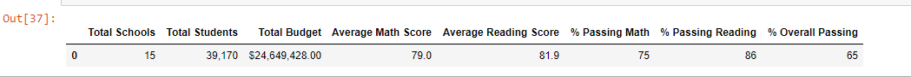
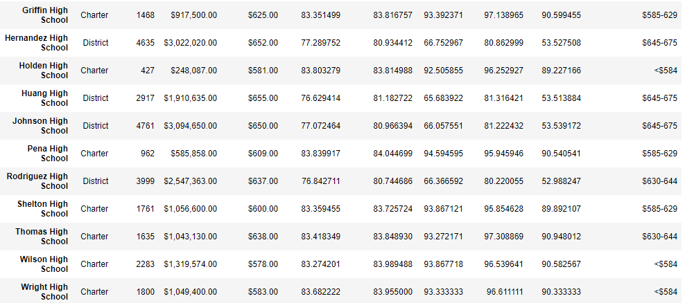
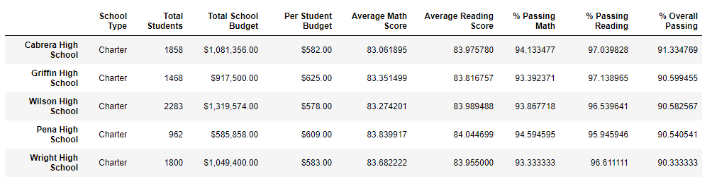
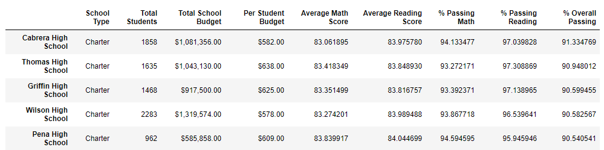
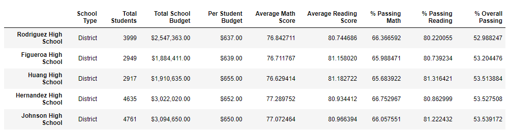
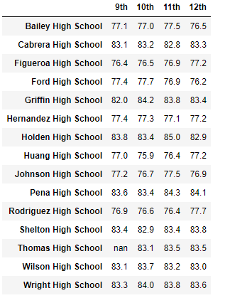
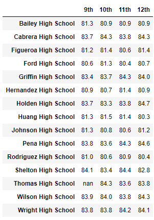

# Py City School District Analysis

## Overview of project

### Purpose
To interpret the Py City School district student data.

## Results

### District Wide Summery 
Analysis of the district data shows overall that the district's ELA departments are well run as 85% of students are passing reading. The math departments in the district might need some reorganization as only 74% of students are passing math.

Removing the tampered data reduced passing percentages accross the board by 1%, it does not seem that removing the freshman grades from Thomas Highschool had much impact on the district.

With the inclusion of tampered data Thomas High School was one of the top perfroming schools in the district.

Without the freshman data Thomas High's performance plumets. Every performance metric drops and the overvall passing percentage drops by around 25 percentage points from 90% to around 65%. 

### School Summery
#### Top 5
The removal of Thomas High freshman data had a promient effect on the district rankings as they were knocked out of the top 5 perfroming schools.

Even with the removal of Thomas five from the top 5, it still remains dominated by Charter Schools. Charter Schools tend to be small to medium sized making them easier to administer, it is likely this is leading their higher performance.

#### Bottom 5
The bottom 5 schools were not affected with the removal of data. The bottom 5 schools were still all medium to large sized district schools

#### Scorces by grade

Average math scores by grade per school.

Average reading scores by grade per school.

## Summery
The tampering of Thomas High freshman data, while debilitating to Thomas High's metrics, overall did not have a major impact on the school district's metrics. The data overall suggets that smaller to more meduim sized schools have the greatest chance to be successful. If additional resources were to be distributed within the district I would suggest more resources be directed towards the math departments, as they were underperforming compared to the ELA departments.
